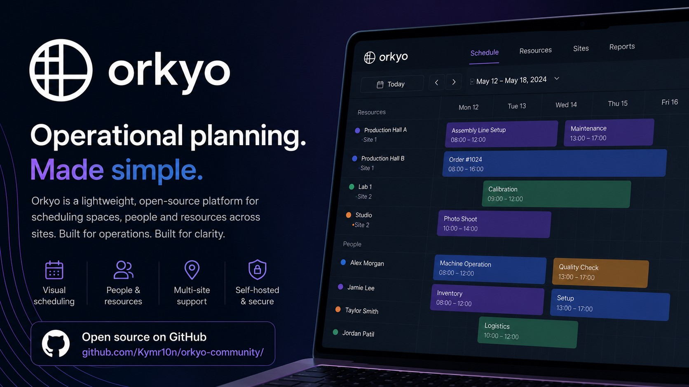
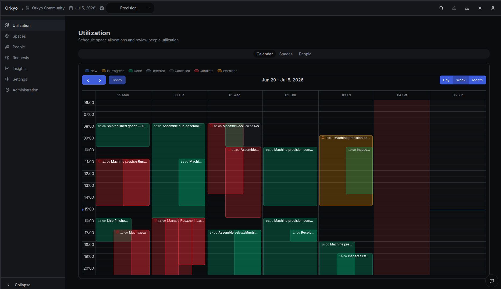
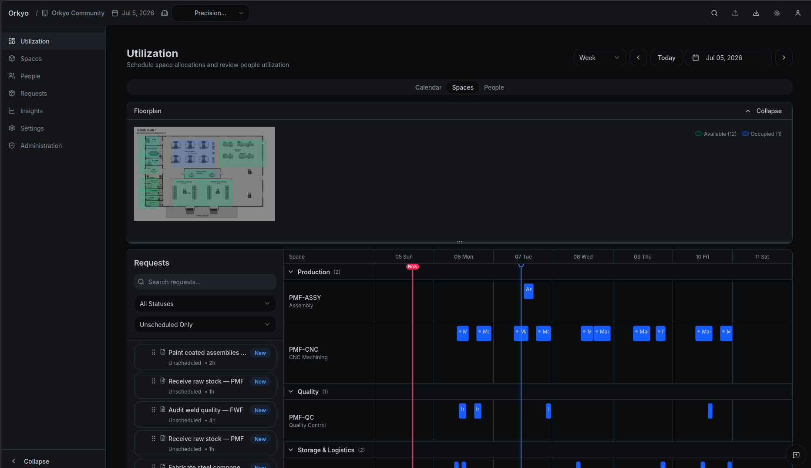
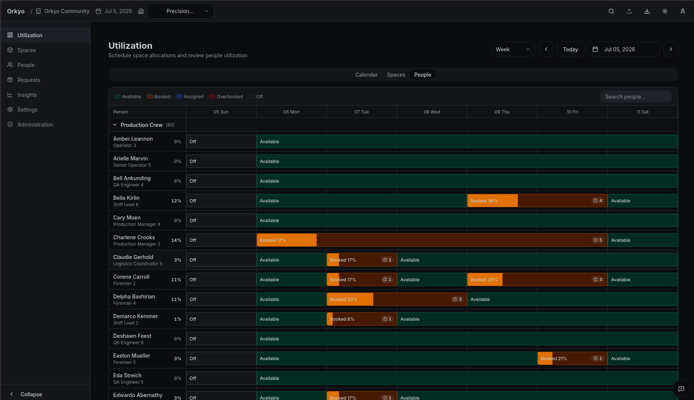
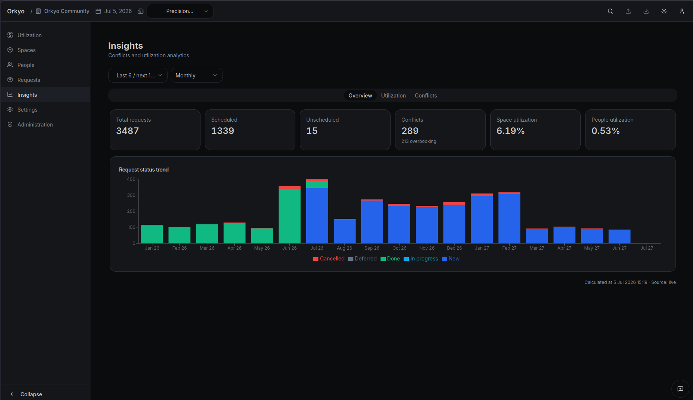
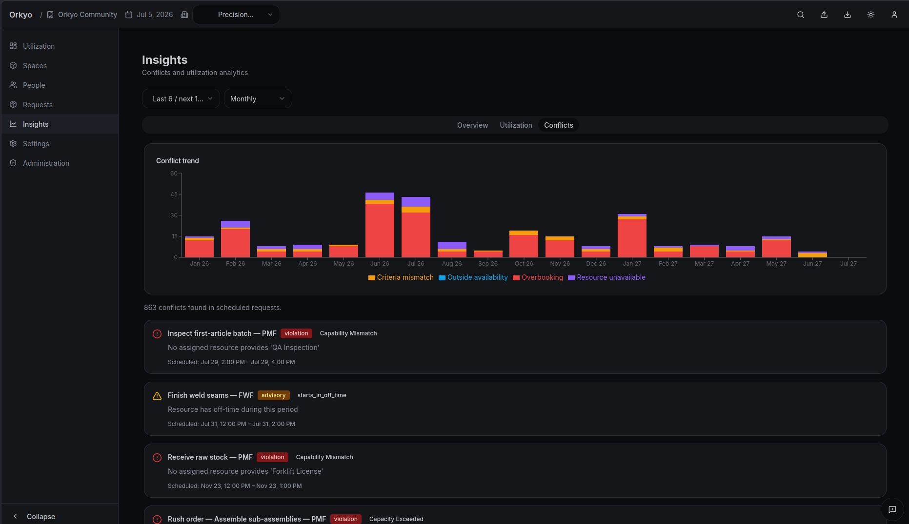

<p align="center">
  <picture>
    <source media="(prefers-color-scheme: dark)" srcset=".github/orkyo-logo-dark.png">
    
  </picture>
</p>

<h3 align="center">Orkyo Community Edition</h3>
<p align="center">Operational planning, made simple.<br>Self-hostable scheduling for spaces, people, and resources across sites.</p>

<p align="center">
  <a href="https://orkyo.com">Website</a> ·
  <a href="https://github.com/Kymr10n/orkyo-community/issues">Issues</a> ·
  <a href="https://github.com/Kymr10n/orkyo-community/discussions">Discussions</a>
</p>

<p align="center">
  <a href="https://github.com/Kymr10n/orkyo-community/actions/workflows/release-ci.yml"></a>
  <a href="https://github.com/Kymr10n/orkyo-community/releases/latest"></a>
  
  
  
</p>

<p align="center">
  
</p>

---

## What is Orkyo?

Teams that coordinate spaces, equipment, and people often run on spreadsheets, email, and meetings — which turns into scheduling conflicts, idle capacity, and avoidable delays as operations grow.

Orkyo replaces that with a shared, visual plan: requests, assignments, conflicts, and utilisation in one place. **Community Edition** is the self-hosted, single-tenant build — one organisation, one database, full control of your data, no subscription.

> **Prefer managed hosting?** [Orkyo Cloud](https://orkyo.com) handles updates, backups, and support.

**Who it's for:** operations & production planners, ops managers, and IT admins who self-host. Manufacturing is the flagship use case; the model fits any spaces-people-resources scheduling problem.

**What it's _not_:** Orkyo is focused on operational scheduling — it is **not** an ERP, MES, or CMMS, and doesn't try to be. It complements those systems rather than replacing them.

## Features

- **Visual planning** — drag-and-drop layout editor with real-time allocation status
- **People & equipment scheduling** — capability matching, absence handling, conflict detection
- **Multi-site** — manage layouts and resources across every location
- **Conflict detection** — catch double-bookings and overloads before they're committed
- **Utilisation tracking** — see where capacity goes, and where it's wasted
- **Request workflow** — teams submit requests; Orkyo matches them to available resources

## Screenshots

|  |  |
|---|---|
| **Calendar scheduling** — plan requests across the week, colour-coded by status and conflict.<br> | **Spaces & floorplan** — schedule work into spaces straight from the request backlog.<br> |
| **People utilisation** — booked vs. available capacity per person, across sites.<br> | **Insights** — request, scheduling, and utilisation trends at a glance.<br> |
| **Conflict detection** — overbooking, capability mismatches, and availability clashes surfaced before commit.<br> | |

## Self-host

**Requirements:** Docker Engine 24+ with Compose v2.

```bash
# Download and extract the latest release bundle
curl -fsSL https://github.com/Kymr10n/orkyo-community/releases/latest/download/orkyo-community.zip -o orkyo-community.zip
unzip -q orkyo-community.zip && cd orkyo-community-v*/

cp .env.template .env
# Edit .env — set POSTGRES_PASSWORD, KEYCLOAK_ADMIN_PASSWORD, KEYCLOAK_BACKEND_CLIENT_SECRET

docker compose up -d
open http://localhost          # port 80 by default; override with FRONTEND_PORT
```

Default login `admin@example.com` / `admin123` — **change it before any non-local deployment.** Images are published to GitHub Container Registry (`ghcr.io/kymr10n/orkyo-community-*`).

- **Portainer:** paste [`release/compose.yml`](release/compose.yml) into the stack editor, fill in the prompted env vars, deploy.
- **Upgrade:** `docker compose pull && docker compose up -d` (migrations run on startup).

Full variable reference: [release/docs/QUICKSTART.md](release/docs/QUICKSTART.md) · backup, upgrade, rollback: [release/docs/OPERATIONS.md](release/docs/OPERATIONS.md).

## Development

**Requirements:** Docker, .NET 10 SDK, Node.js 22, and [`orkyo-foundation`](https://github.com/Kymr10n/orkyo-foundation) cloned as a sibling directory.

```bash
git clone https://github.com/Kymr10n/orkyo-community.git
git clone https://github.com/Kymr10n/orkyo-foundation.git   # sibling directory
cd orkyo-community
cp .env.template .env
```

**Simplest — full stack in containers, one command:**

```bash
./dev.sh rebuild     # build images and start everything
./dev.sh seed --profile manufacturing --scale large --mode reset   # optional demo data
```

**Active development — host processes with hot-reload:**

```bash
./dev.sh infra       # Postgres, Valkey, Keycloak, MailHog (Docker)
./dev.sh migrator    # apply DB migrations
./dev.sh api         # API (dotnet run, hot-reload)
./dev.sh frontend    # Vite dev server
```

| Service  | URL |
|---|---|
| Frontend | http://localhost:5174 |
| API      | http://localhost:5002 |
| Keycloak | http://localhost:8082 |
| MailHog  | http://localhost:8026 |

```bash
dotnet test backend/tests/          # backend unit + integration (needs Docker)
cd frontend && npm test -- --run    # frontend unit tests
```

## Architecture

```
orkyo-community/
  backend/api/         — ASP.NET Core 10 API host (single-tenant adapters)
  backend/src/         — Community services and context wiring
  backend/migrations/  — DB migration module (runs after foundation migrations)
  backend/migrator/    — CLI migrator entry point
  frontend/            — Vite + React 19 frontend
  compose.local.yml    — local dev stack
  release/             — production bundle (Compose, env template, docs)
```

Shared domain logic — endpoints, repositories, scheduling, UI components — lives in [`orkyo-foundation`](https://github.com/Kymr10n/orkyo-foundation). Community supplies single-tenant adapters so foundation code runs without multi-tenant machinery.

## Roadmap

Active development, pre-1.0. Near-term: availability & absence model, notifications, calendar/iCal integration. See [ROADMAP.md](ROADMAP.md) — and [open an issue](https://github.com/Kymr10n/orkyo-community/issues) or [discussion](https://github.com/Kymr10n/orkyo-community/discussions) with requests.

## Support

Community-supported, best-effort, via [Issues](https://github.com/Kymr10n/orkyo-community/issues) (bugs) and [Discussions](https://github.com/Kymr10n/orkyo-community/discussions) (questions, setup help). No SLA or installation support — for managed support see [Orkyo Cloud](https://orkyo.com/support).

## Contributing

See [CONTRIBUTING.md](.github/CONTRIBUTING.md). Bug reports and well-scoped pull requests are welcome; feature requests are weighed against the roadmap.

## License

[GNU Affero General Public License v3.0](LICENSE) — use, modify, and self-host freely, but if you offer it as a network service you must publish your modifications under the same licence. For commercial or OEM licensing, contact [contact@orkyo.com](mailto:contact@orkyo.com).
